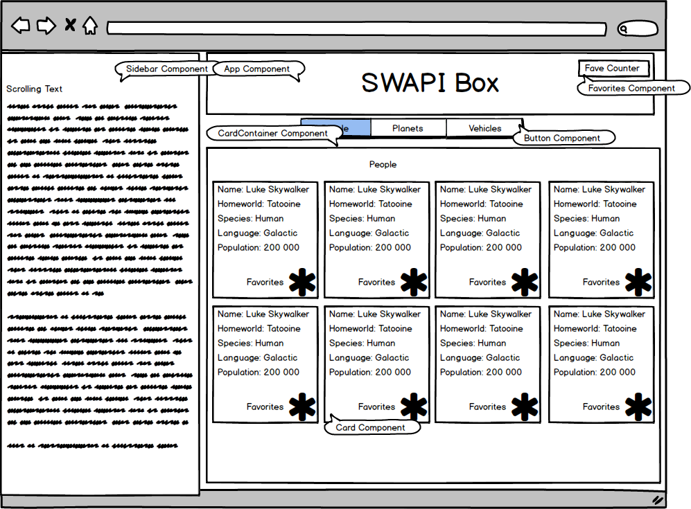
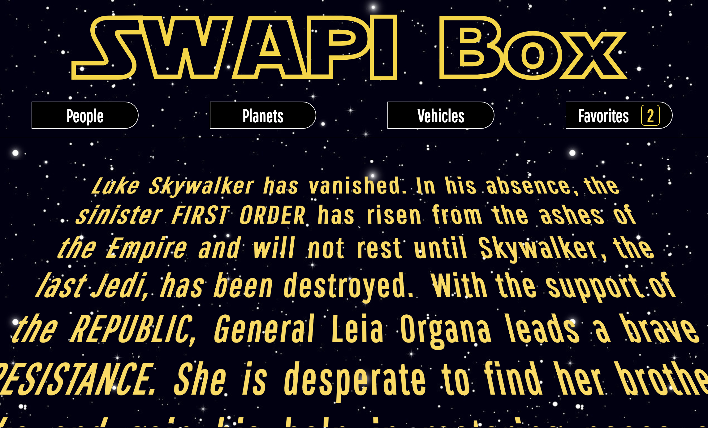
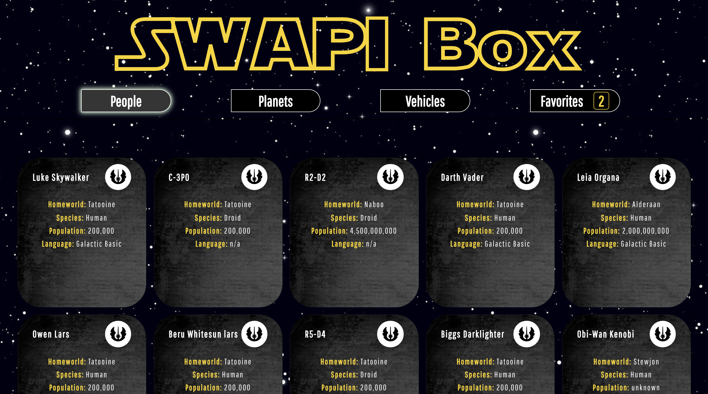
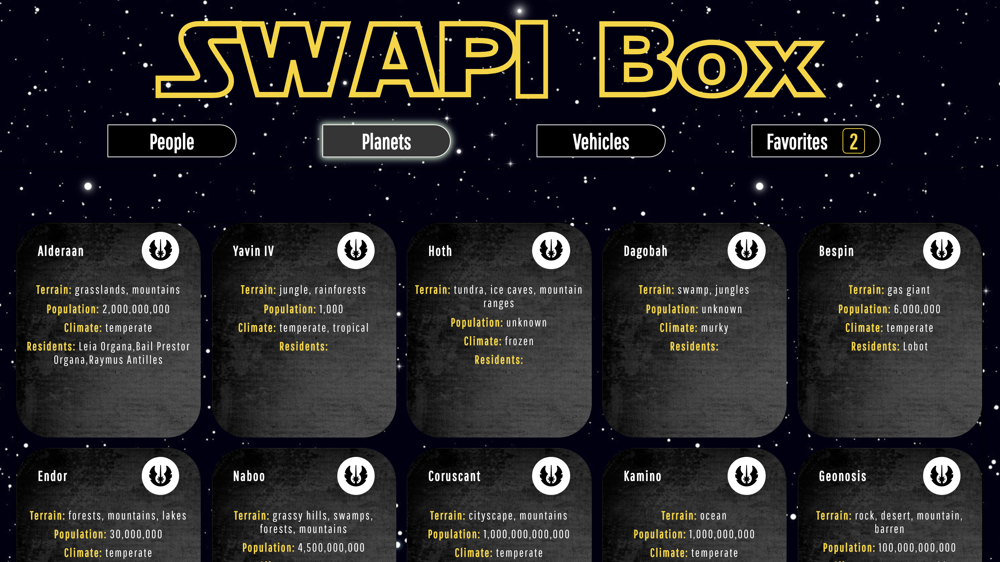
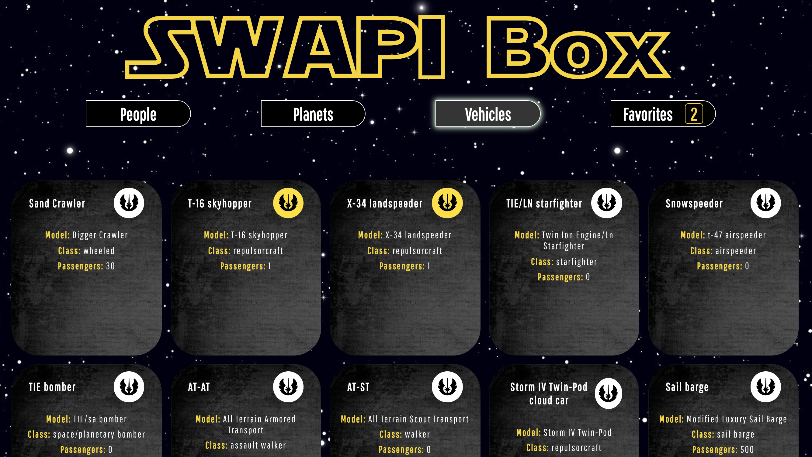
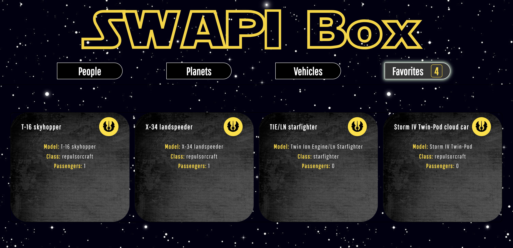

[](https://github.com/facebook/jest) 
[](https://github.com/facebook/jest)
[](https://waffle.io/alexanderela/swapibox)

# Star Wars API (SWAPI) Box
This app lets users view various pieces of Star Wars fan trivia, orgainzed by category and displayed on individual 'cards' within a user-friendly interface.  The project uses the [Star Wars API (SWAPI)](https://swapi.co) to gather trivia information about Star Wars films and characters.  The app's title screen features a scrolling text from a randomly selected Star Wars film.  Users have the ability to select favorite card, which they can then view on a separate 'Favorites' page.

## Deployed App
[Star Wars API (SWAPI) Box](https://infallible-einstein-c548f9.netlify.com/)

[See it live!  A screen recording of the application](https://github.com/djcaraballo/SWAPI-box/blob/master/src/assets/SWAPI-screenshots/ScreenVideo.gif)

## Getting Started
This is a general guide to setting up a Recharge API development environment on your local machine.

### Dependencies
* React.js
* React Router
* CSS3 
* Jest and Enzyme for testing
* See package.json for a list of required modules


### Developers:

#### Retrieve and Save Unique API Keys
This application uses data from the [Star Wars API](https://swapi.co). You will need a free API key to fetch the data. Click [here](https://swapi.co) to create a free account and receive your key.

#### Save and Export API Key
Check out [this site](https://gist.github.com/derzorngottes/3b57edc1f996dddcab25) to learn more about saving API keys.

#### Get the app on your local machine
* Fork this repo using the `Fork` button in the upper right corner of this page.

* `Clone` your fork onto your local machine
```
git clone https://github.com/YOUR_GITHUB_USERNAME_HERE/star-wars-api-box
```

* Jump into that directory on your local machine
```
cd star-wars-api-box
```

* Add an upstream remote that points to the main repo:
```
git remote add upstream https://github.com/alexanderela/star-wars-api-box.git
```

* Fetch the latest version of `master` from `upstream`
```
git fetch upstream master
```


#### Install and Start Server

* `npm install` all dependencies.

* `npm start` the development server.


### Contributing
This guide assumes that the git remote name of the main repo is `upstream` and that **your** fork is named `origin`.

Create a new branch on your local machine to make your changes against (based on `upstream/master`):
```
git checkout -b branch-name-here --no-track upstream/master
```
We recommend naming your branch using the following convention:
```
#(issueNumber)-feature-name-your-name
ex: 36-middleware-error-handling-alex
```

#### Contribute using GitHub Issues
* Click on the `Issues` tab at the top left of this page
* Choose one and work on your local machine to fix it  
  - We recommend naming your branch according to the above convention  
  - Use TDD as much as possible 
  - Once the tests are passing, you can commit your changes. See [Making a great commit for more tips](https://github.com/openfoodfoundation/openfoodnetwork/wiki/Making-a-great-commit).  
```
git add .
git commit -m "Add a concise commit message describing your change here"
```
  - Before pushing to your fork, rebase your commits against the upstream master branch
```
git pull --rebase upstream master
```
  - Push your changes to a branch on your fork:
```
git push origin branch-name-here
```

#### Submitting a Pull Request
* Create a Pull Request (PR) to this repo's master using GitHub's UI
* Fill in the requested information re: what you worked on
* Keep your PR small, with a single focus

## Technologies Used
This project was bootstrapped with [Create React App](https://github.com/facebook/create-react-app).

Other technologies used:
- React.js
- React Router
- Jest
- Enzyme

## Project Requirements
Project spec can be found [here](http://frontend.turing.io/projects/swapi-box.html)

## This is a partnered project designed and coded by:
* Dina Caraballo - [Github.com/djcaraballo](https://github.com/djcaraballo)
* Alexander Ela - [Github.com/alexanderela](https://github.com/alexanderela)

## Wireframe


## Desktop View
#### Landing Page


#### People Cards


#### Planets Cards


#### Vehicles Cards


#### Favorites Cards


## This README relied upon Open Food Source's extensive and excellent [Set Up](https://github.com/openfoodfoundation/openfoodnetwork/blob/master/GETTING_STARTED.md) and [Contibution](https://github.com/openfoodfoundation/openfoodnetwork/blob/master/CONTRIBUTING.md) docs.
